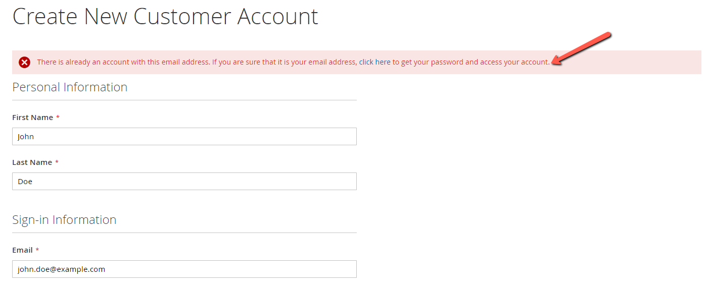
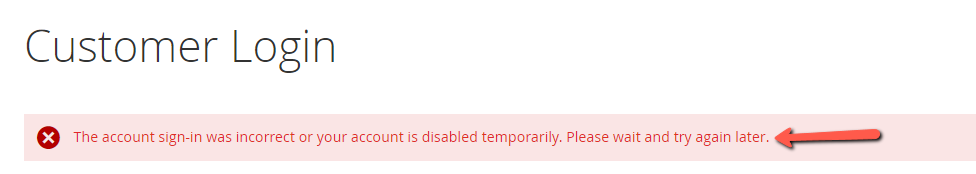
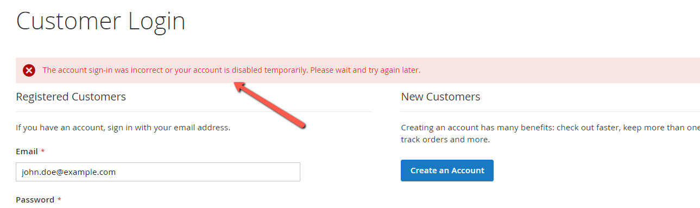

# Bug Report 1

## Title:
Registration form allows existing email without proper message handling

## Environment:
- **Browser:** Chrome 137.0.7151.57  
- **OS:** Windows 10  
- **URL:** https://magento.softwaretestingboard.com/customer/account/create/  
- **User role:** New user  

## Preconditions:
User is on the registration page

---

**Test Case:**  
**TS01 - Register with valid user data**  
**Test Design Technique:** Equivalence Partitioning

---

## Steps to Reproduce:
1. Enter First Name: John  
2. Enter Last Name: Doe  
3. Enter Email: john.doe@example.com (already registered)  
4. Enter Password: Password123!  
5. Confirm Password  
6. Click "Create an Account"  

## Expected Result:
User is informed clearly:  
"This email is already registered. Please log in or reset your password."

## Actual Result:
Message shown:  
> There is already an account with this email address. If you are sure that it is your email address, click here to get your password and access your account.

---

**Problem:**
This message may confuse a new user, as it lacks clear options (e.g., link to login or reset password).

## Severity:
Low

## Priority:
Medium

## Attachments:

# Bug Report 2

**Title:**  
Unable to login with valid credentials – valid user receives error message

**Environment:**  
- **Browser:** Chrome 137.0.7151.57  
- **OS:** Windows 10  
- **URL:** https://magento.softwaretestingboard.com/customer/account/login/  
- **User role:** Registered user  

---

**Preconditions:**  
User `john.doe@example.com` is already registered and confirmed

---

**Test Case:**  
**TS05 – Login with valid credentials**  
**Test Design Technique:** Decision Table

---

**Steps to Reproduce:**  
1. Navigate to login page  
2. Enter valid email: `john.doe@example.com`  
3. Enter valid password: `Password123!`  
4. Click "Sign In"

---

**Expected Result:**  
User is successfully logged in and redirected to account dashboard.

---

**Problem:**  
User cannot log in despite providing correct credentials. This blocks access and indicates a possible bug in authentication or user status.

---

**Severity:** High  
**Priority:** High  
**Attachments:**  

# Bug Report 3

**Title:**  
Incorrect password returns confusing message – no clear "Invalid password" prompt

**Environment:**  
- **Browser:** Chrome 137.0.7151.57  
- **OS:** Windows 10  
- **URL:** https://magento.softwaretestingboard.com/customer/account/login/  
- **User role:** Any existing user  

---

**Preconditions:**  
User is registered

---

**Test Case:**  
**TS06 – Login with incorrect password**  
**Test Design Technique:** Decision Table

---

**Steps to Reproduce:**  
1. Navigate to login page  
2. Enter valid email: `john.doe@example.com`  
3. Enter incorrect password: `WrongPassword!`  
4. Click "Sign In"

---

**Expected Result:**  
User sees error message: "Invalid login or password."

**Actual Result:**  
The account sign-in was incorrect or your account is disabled temporarily. Please wait and try again later.

---

**Problem:**  
The error message is too generic or misleading for wrong credentials. It may suggest account lockout, confusing users.

---

**Severity:** Medium  
**Priority:** Medium  
**Attachments:**  

# Bug Report 4

**Title:**  
Registered user cannot proceed to checkout – login fails during authenticated session

**Environment:**  
- **Browser:** Chrome 137.0.7151.57  
- **OS:** Windows 10  
- **URL:** https://magento.softwaretestingboard.com/checkout/  
- **User role:** Registered user  

---

**Preconditions:**  
User `john.doe@example.com` is already registered and logged in

---

**Test Case:**  
**TC10 – Complete checkout as registered user**  
**Test Design Technique:** Equivalence Partitioning (EP)

---

**Steps to Reproduce:**  
1. Log in as registered user  
2. Add any product to cart  
3. Proceed to checkout  
4. Enter shipping and payment information  
5. Click "Place Order"

---

**Expected Result:**  
Order is successfully placed and confirmation message is displayed.

**Actual Result:**
Message shown:
The account sign-in was incorrect or your account is disabled temporarily. Please wait and try again later.

---

**Problem:**  
The user is unexpectedly logged out or rejected during checkout, making it impossible to place the order despite a valid login session. This blocks the core functionality of the platform for registered users.

---

**Severity:** High  
**Priority:** High  
**Attachments:**  

